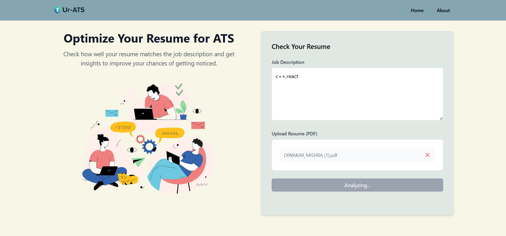

# UR-ATS Resume Checker 📄✨


[](https://app.netlify.com/sites/comforting-youtiao-3c29ef/deploys)
[](https://comforting-youtiao-3c29ef.netlify.app/)

<div align="center">
  
  
  🚀 A modern ATS (Applicant Tracking System) resume checker to optimize your job applications
</div>

## ✨ Features

- 📝 Compare your resume against job descriptions
- 📊 Get instant ATS compatibility score
- 📈 Interactive pie chart visualization
- 📱 Fully responsive design
- 🔍 Keyword analysis
- 💾 PDF resume parsing

## 🛠️ Tech Stack

### Frontend
- 
- 
- 

### Backend
- 
- 
- 

## 🚀 Live Demo

Check out the live demo: [UR-ATS Resume Checker](https://comforting-youtiao-3c29ef.netlify.app/)

## 🌟 Key Features

### Resume Analysis
- Upload PDF resumes
- Extract and analyze text content
- Compare against job descriptions
- Calculate matching scores

### User Interface
- Clean, modern design
- Responsive layout
- Interactive visualizations
- Real-time feedback

### Backend Processing
- Secure file handling
- PDF text extraction
- Keyword matching algorithm
- MongoDB data storage

## 💻 Local Development

1. Clone the repository
```bash
git clone https://github.com/yourusername/your-repo-name.git
cd your-repo-name
